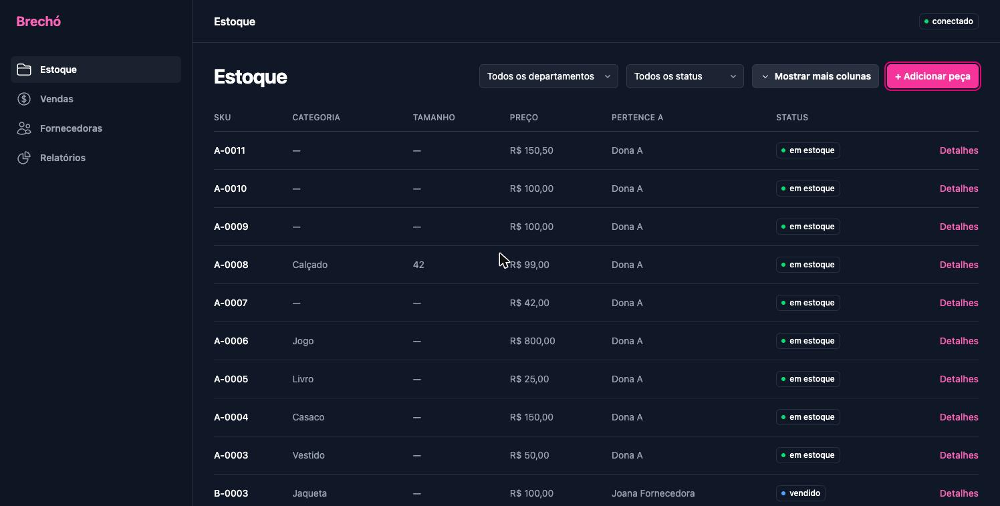
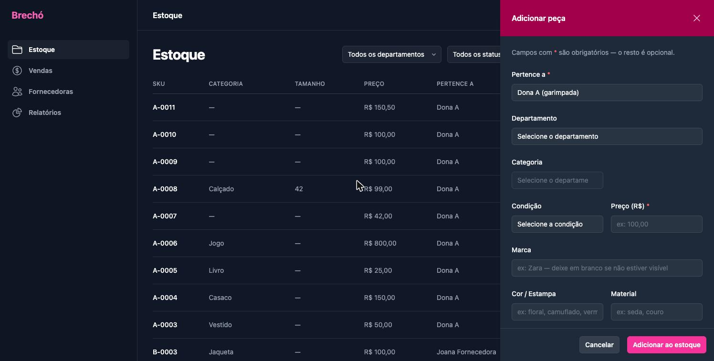
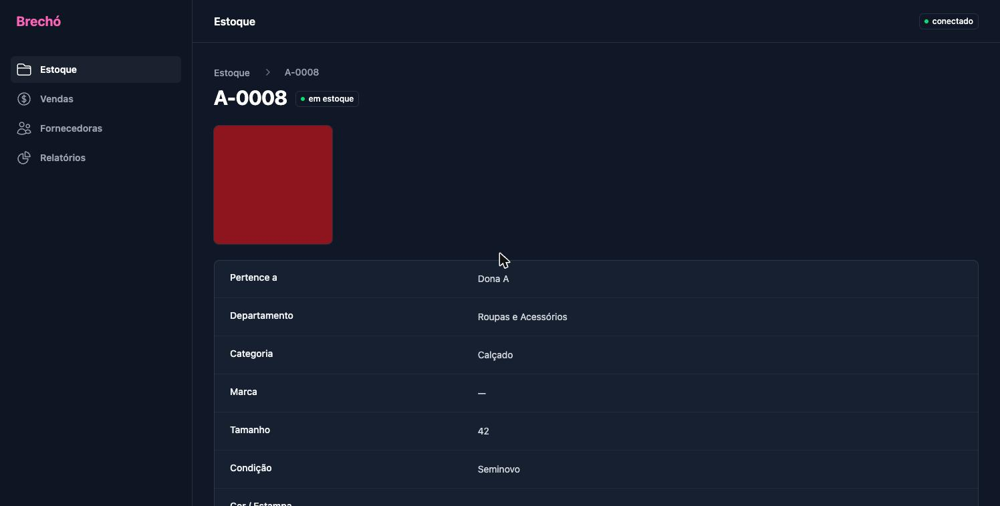
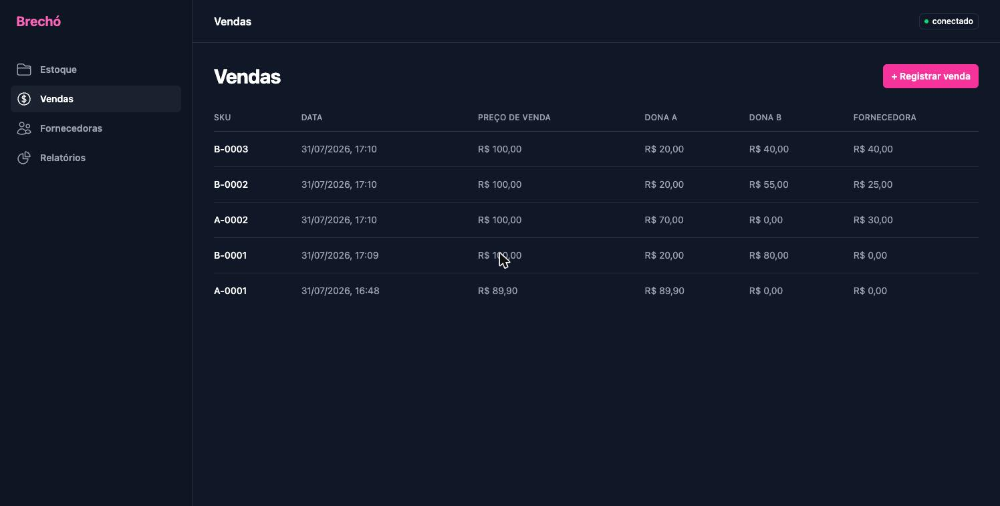
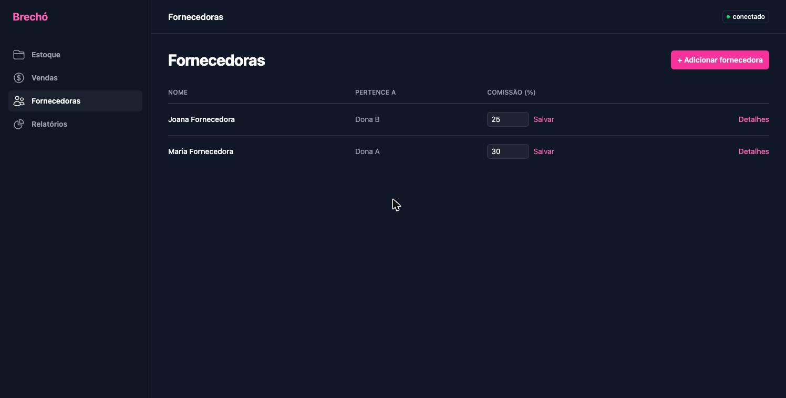
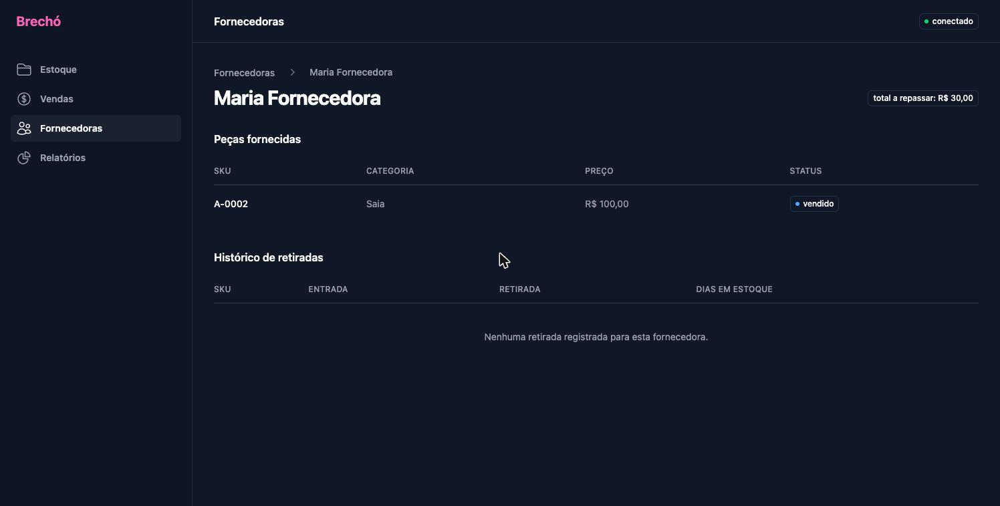
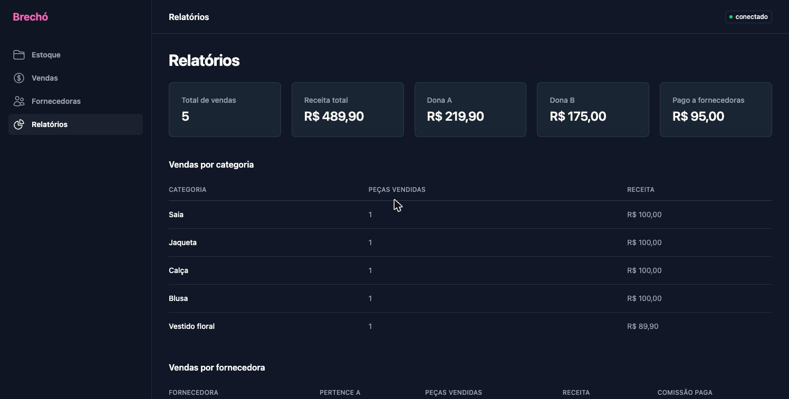

# Brechó

Sistema de controle de estoque, vendas e fornecedoras para o brechó — feito para rodar direto no computador da loja, sem precisar de internet.



Este documento é o manual de uso do sistema. Ele foi escrito para quem usa o programa no dia a dia — não é preciso nenhum conhecimento técnico para seguir os passos abaixo.

## Índice

- [Como abrir o programa](#como-abrir-o-programa)
- [Conhecendo as áreas do sistema](#conhecendo-as-áreas-do-sistema)
- [Estoque](#estoque)
  - [Adicionar uma peça](#adicionar-uma-peça)
  - [Departamento e Categoria](#departamento-e-categoria)
  - [Filtrar e ver mais colunas](#filtrar-e-ver-mais-colunas)
  - [Ver os detalhes de uma peça](#ver-os-detalhes-de-uma-peça)
  - [Retirar uma peça](#retirar-uma-peça)
- [Vendas](#vendas)
- [Como o dinheiro de cada venda é dividido](#como-o-dinheiro-de-cada-venda-é-dividido)
- [Fornecedoras](#fornecedoras)
- [Relatórios](#relatórios)
- [Perguntas frequentes](#perguntas-frequentes)
- [Para desenvolvedores](#para-desenvolvedores)

---

## Como abrir o programa

O sistema roda como um aplicativo comum do computador. Basta dar dois cliques no ícone do **Brechó** para abrir.

> **Se a tela parecer "travada" ou não mostrar uma peça que você acabou de cadastrar:** feche o programa completamente (não só a janela — feche de verdade) e abra de novo. Isso resolve quase todos os casos em que a tela parece desatualizada.

Não é preciso internet para usar o sistema. Tudo fica salvo no próprio computador da loja.

---

## Conhecendo as áreas do sistema

No menu do lado esquerdo ficam as quatro áreas do sistema:

| Área | Para que serve |
|---|---|
| **Estoque** | Cadastrar peças novas e ver tudo que está (ou já esteve) na loja |
| **Vendas** | Registrar uma venda e ver o histórico de vendas |
| **Fornecedoras** | Cadastrar fornecedoras e acompanhar quanto se deve a cada uma |
| **Relatórios** | Ver o resumo de quanto cada dona ganhou e como as vendas estão indo |

No canto superior direito, a bolinha ao lado de "conectado" mostra se o sistema está funcionando normalmente. Se aparecer vermelho e "sistema indisponível", feche e abra o programa novamente.

---

## Estoque

A tela de Estoque mostra todas as peças já cadastradas — à venda, vendidas ou retiradas por uma fornecedora.

### Adicionar uma peça

Clique no botão **"+ Adicionar peça"**, no canto superior direito da tela de Estoque.



Um painel abre do lado direito com os campos abaixo. Os campos marcados com **\*** são **obrigatórios** — todos os outros são opcionais e podem ficar em branco se você não souber ou não for relevante para aquela peça.

| Campo | O que preencher |
|---|---|
| **Pertence a** \* | Se a peça é garimpada por uma das donas, ou se veio de uma fornecedora cadastrada |
| **Departamento** \* | A seção geral da peça — roupa, casa, eletrônico, etc. (veja a explicação abaixo) |
| **Categoria** | O tipo exato da peça dentro do departamento escolhido |
| **Tamanho** | Só aparece quando faz sentido para a categoria escolhida (veja abaixo) |
| **Condição** | Novo com etiqueta, novo sem etiqueta, seminovo ou usado |
| **Preço** \* | O preço de venda, em reais. Pode digitar com vírgula (`100,00`) ou ponto (`100.00`) — os dois funcionam |
| **Marca** | Se tiver etiqueta visível. Pode deixar em branco |
| **Cor / Estampa** | Ex: floral, listrado, vermelho |
| **Material** | Ex: seda, couro, algodão |
| **Observações** | Qualquer detalhe importante — um defeito, uma mancha, algo que vale avisar na hora da venda |
| **Comissão específica (%)** | Só preencha se **essa peça em especial** tiver uma comissão diferente da comissão padrão da fornecedora. Deixe em branco para usar o padrão dela |
| **Fotos** | Uma ou mais fotos da peça. Clique em "Choose Files" para escolher as imagens do computador |

Depois de preencher, clique em **"Adicionar ao estoque"**. O sistema gera automaticamente um código (SKU) para a peça, como `A-0001` ou `B-0003` — a letra indica de qual dona é o lado daquela peça.

### Departamento e Categoria

Como a loja não vende só roupa, o cadastro é dividido em dois passos: primeiro o **Departamento** (a seção geral), depois a **Categoria** (o tipo exato dentro daquela seção). A lista de Categoria só aparece depois que você escolhe o Departamento.

Departamentos disponíveis e as categorias de cada um:

- **Roupas e Acessórios** — Vestido, Blusa, Camisa, Saia, Calça, Short, Casaco, Jaqueta, Moletom, Macacão, Conjunto, Acessório, Calçado, Bolsa, Outro
- **Casa e Decoração** — Móveis, Decoração, Iluminação, Cama/mesa/banho, Cortinas e tapetes, Utensílios de cozinha, Louças e vidros, Outro
- **Eletrônicos e Eletrodomésticos** — Eletrodoméstico, Eletrônico, Informática, Outro
- **Livros e Mídia** — Livro, Mídia (CD/DVD/vinil), Revista, Outro
- **Brinquedos e Jogos** — Brinquedo, Jogo, Outro
- **Outros** — para qualquer peça que não se encaixe nas seções acima

Se não tiver certeza, use **"Outro"** dentro do departamento mais parecido. Não tem problema nenhum.

**Sobre o campo Tamanho:** ele muda de acordo com a categoria escolhida —

- Para roupas normais (vestido, blusa, calça...): aparecem os tamanhos de roupa (PP, P, M, G, GG, XG, Único).
- Para **Calçado**: aparece a numeração de sapato brasileira (33 a 44, ou Único).
- Para **Bolsa** e **Acessório**: o campo Tamanho nem aparece, porque não se aplica.
- Para qualquer peça fora do departamento Roupas e Acessórios: o campo Tamanho também não aparece.

### Filtrar e ver mais colunas

No topo da tela de Estoque tem dois filtros: um por **departamento** e outro por **status** (em estoque, vendido, retirado). Use-os para achar peças mais rápido numa lista grande.

A tabela mostra só as colunas mais importantes por padrão, para caber bem na tela. Clique em **"Mostrar mais colunas"** para ver também Departamento, Marca, Cor/Estampa, Material, Condição e Observações. Clique de novo (agora "Mostrar menos colunas") para voltar ao modo compacto.

### Ver os detalhes de uma peça

Clique em **"Detalhes"**, na frente de qualquer peça na lista, para abrir a página completa daquela peça — com todas as fotos, todos os campos preenchidos e, se a peça já foi vendida ou retirada, também os detalhes da venda ou da retirada.



### Retirar uma peça

Se uma fornecedora quiser levar de volta uma peça que não vendeu, clique em **"Retirar"** na linha daquela peça (só aparece para peças de fornecedoras que ainda estão em estoque). O sistema pede uma confirmação antes de marcar a peça como retirada — ela não é apagada, só passa a aparecer esmaecida na lista, para manter o histórico.

---

## Vendas

Para registrar uma venda, vá em **Vendas** no menu e clique em **"+ Registrar venda"**. Escolha a peça vendida — o preço sugerido já vem preenchido com o preço cadastrado da peça, mas pode ser alterado se a venda foi por outro valor. Depois de confirmar, a peça passa automaticamente para "vendido" e some da lista de peças disponíveis para venda.



A cada venda, o sistema já calcula e guarda como o valor foi dividido entre Dona A, Dona B e a fornecedora (se houver). Essa divisão nunca muda depois — mesmo que a comissão de uma fornecedora seja alterada no futuro, as vendas já registradas mantêm o valor de quando foram feitas.

---

## Como o dinheiro de cada venda é dividido

Essa é a regra por trás dos números que aparecem em Vendas e Relatórios. Toda peça pertence a um "lado" — o de Dona A ou o de Dona B — e a divisão do valor da venda depende de qual lado é e se a peça é garimpada ou de fornecedora.

1. **Peça garimpada pela própria Dona A** → Dona A fica com **100%** do valor.
2. **Peça garimpada pela Dona B** → Dona A recebe **20%**, Dona B fica com os outros **80%**.
3. **Peça de uma fornecedora do lado da Dona A** → a fornecedora recebe a comissão dela, e Dona A fica com o restante (sem desconto de 20%, porque a peça já é do lado dela).
4. **Peça de uma fornecedora do lado da Dona B** → Dona A recebe **20%** do valor, a fornecedora recebe a comissão dela, e Dona B fica com o que sobrar.

Em outras palavras: Dona A sempre tem uma participação de 20% em tudo que é vendido do lado da Dona B — nas peças dela e nas peças das fornecedoras dela. O contrário não acontece: Dona B não recebe nada das vendas do lado da Dona A.

A comissão de cada fornecedora é definida no cadastro dela (veja [Fornecedoras](#fornecedoras)) e pode ser diferente para cada uma. Também é possível definir uma comissão específica só para uma peça, no campo "Comissão específica (%)" ao cadastrá-la.

---

## Fornecedoras

Em **Fornecedoras**, clique em **"+ Adicionar fornecedora"** para cadastrar uma nova. É preciso informar o nome, de qual dona ela é fornecedora e a comissão padrão dela (em %).



Na lista, é possível alterar a comissão de uma fornecedora a qualquer momento — edite o número e clique em "Salvar". Isso não muda o valor de vendas já registradas, só das próximas.

> **Uma fornecedora não pode ser transferida para a outra dona dentro do sistema.** Se isso realmente precisar acontecer (uma fornecedora que passou a fornecer para a outra sócia), é uma correção que precisa ser feita por fora, com quem dá suporte técnico ao sistema — não é uma opção do dia a dia, de propósito.

Clique em **"Detalhes"** para ver a página completa de uma fornecedora: todas as peças que ela já forneceu, quanto ainda se deve repassar a ela, e o histórico de peças que ela retirou sem vender.



---

## Relatórios

A tela de Relatórios traz um resumo geral: total de vendas, receita total, quanto cada dona já ganhou e quanto já foi pago a fornecedoras — sempre calculado a partir das vendas já registradas, nunca um valor estimado.



Logo abaixo dos números, há três tabelas com mais detalhe: vendas por categoria, vendas por fornecedora e vendas ao longo do tempo (por mês ou por dia).

---

## Perguntas frequentes

**A tela não atualiza depois que eu cadastro uma peça.**
Feche o programa completamente e abra de novo. Isso resolve praticamente sempre.

**Coloquei o preço mas o sistema disse que o campo estava vazio.**
Pode digitar o preço com vírgula (`100,00`) normalmente — o sistema já entende os dois formatos. Se ainda acontecer, confira se realmente há um número no campo antes de salvar.

**Não sei em qual departamento ou categoria colocar uma peça.**
Use "Outros" como departamento, ou "Outro" como categoria dentro do departamento que parecer mais próximo. Não tem problema cadastrar assim.

**Uma fornecedora quer levar de volta uma peça.**
Vá até a peça em Estoque e clique em "Retirar". A peça fica marcada como retirada, sem custo, e continua no histórico.

**Uma das donas saiu do negócio — o que muda?**
Isso é uma situação rara e é resolvida por quem dá suporte técnico ao sistema, não pelo uso normal do dia a dia. A partir do momento em que só resta uma dona ativa, todo o valor das vendas passa a ir integralmente para ela (menos a comissão de fornecedoras, que continua sendo paga normalmente).

---

## Para desenvolvedores

Aplicativo de desktop local: **FastAPI** (Python) servindo uma interface **HTML/CSS/JS** simples (sem framework), empacotado com **pywebview**. Banco de dados **SQLite**, tudo local — sem servidor externo, sem sincronização entre dispositivos.

### Rodando o projeto

```bash
python -m venv .venv
source .venv/bin/activate
pip install -r requirements.txt
python app.py
```

### Alterando o front-end

O CSS é gerado a partir dos componentes do Tailwind Plus e precisa ser recompilado depois de qualquer mudança em `frontend/index.html` ou `frontend/src/input.css`:

```bash
npm install
npm run build
```

Isso gera `frontend/styles.css` e `frontend/vendor/elements.js` — os dois são versionados no repositório, já que o aplicativo empacotado não tem Node.js disponível em tempo de execução.

### Testes

```bash
pytest
```

### Painel de administração

Existe um painel separado do aplicativo principal, para correções pontuais direto no banco de dados. Não é uma tela de uso diário e não tem nenhum link dentro do sistema — só é alcançável por quem sabe o endereço e a senha.

**Acesso:** com o aplicativo rodando, abra `http://127.0.0.1:8000/admin.html` numa aba de navegador comum. A janela do Brechó não tem barra de endereço, então não dá para chegar lá por dentro dela — é preciso abrir num navegador à parte, em paralelo.

**Senha:** independente do PIN das donas, definida via terminal:

```bash
python -m backend.set_admin_password
```

Pede a senha duas vezes (não aparece na tela) e salva o hash no banco. Pode ser rodado de novo a qualquer momento para trocar a senha.

**O que o painel faz:** ver, criar, editar e excluir diretamente qualquer linha de qualquer tabela do banco (donas, fornecedoras, peças, vendas, recibos, repasses, retiradas e histórico de edições) — como um mini admin do Django. A tabela com a senha do próprio painel nunca aparece nele, para não haver risco de se trancar para fora.

**Cuidado:** o painel edita o banco direto, sem passar pelas regras de negócio que o resto do sistema aplica — por exemplo, o cálculo de divisão de uma venda ou a trava que impede vender a mesma peça duas vezes. Use só para corrigir um dado errado, não para operações do dia a dia. Excluir uma linha é definitivo.

`roadmap.md` documenta as decisões de negócio e o histórico de planejamento do projeto.
